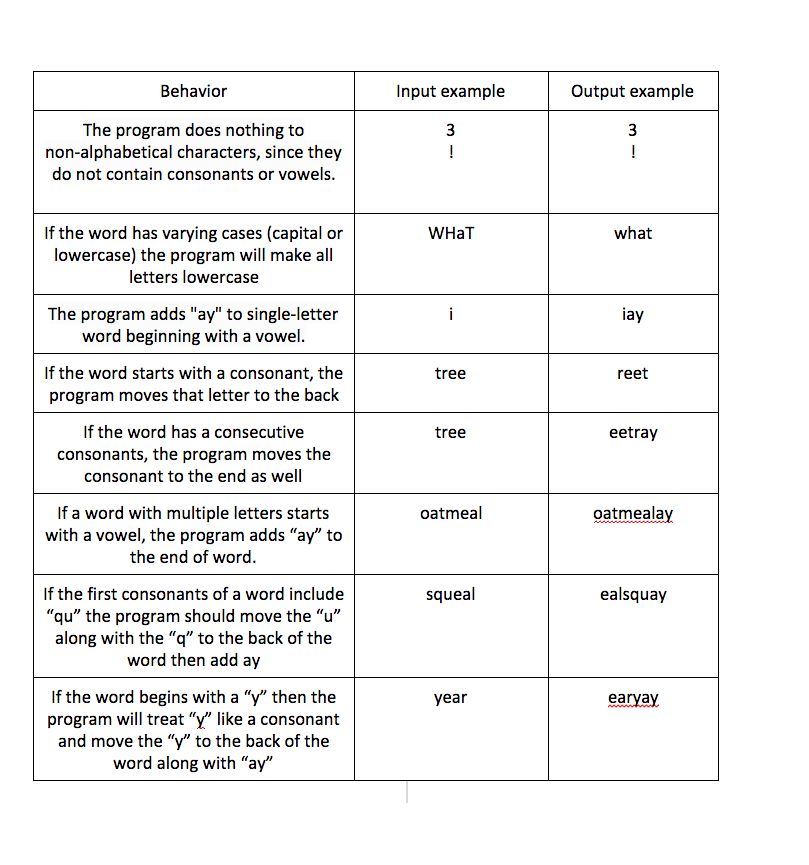

# Pig Latin Translator

#### A simple webpage that translates sentences into pig latin.

#### By Aimen Khakwani and Katy Henning

## Description
 A simple webpage that uses javaScript to translate user inputted sentences into pig latin.

## Setup and Installation
 Download from Github onto local drive

# Support and Contact
Please contact us through Github

## Technologies Used
* HTML
* CSS
* Bootstrap
* javaScript
* jQuery

### License
MIT
Copyright (c) 2016 by Aimen K and Katy H

### Specs

